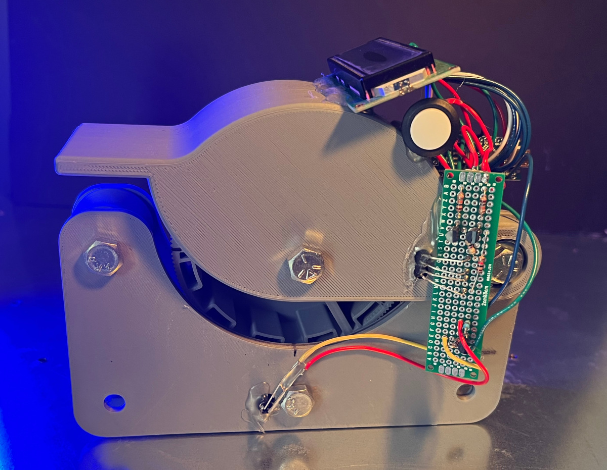
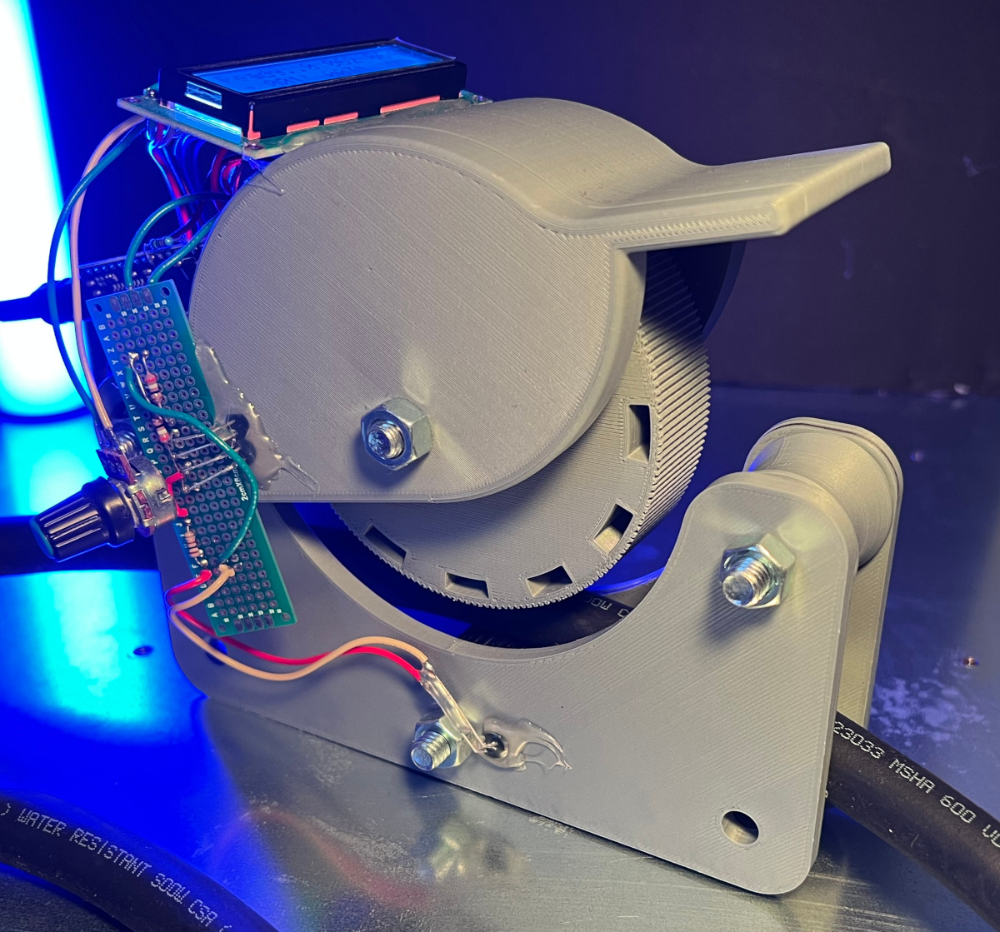
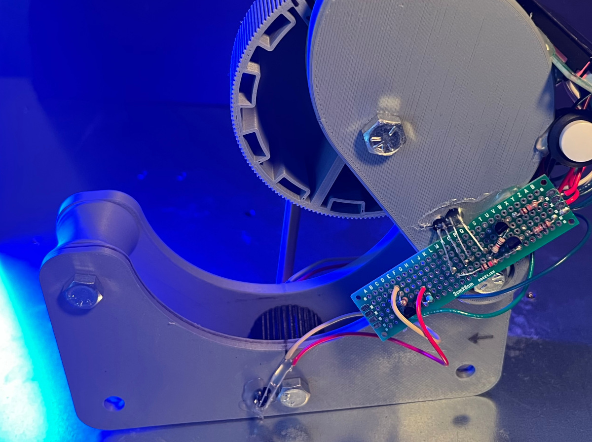
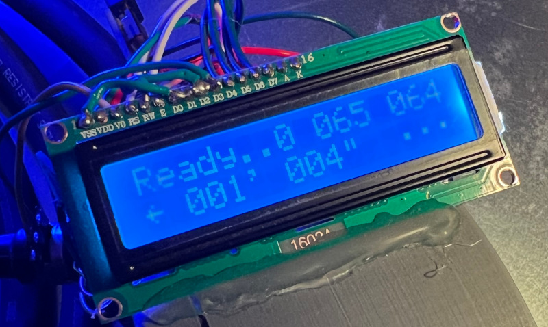
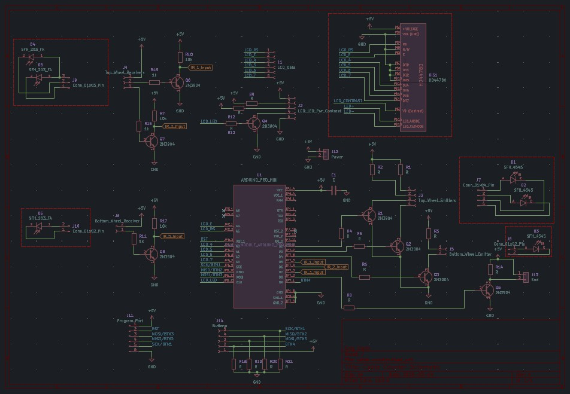
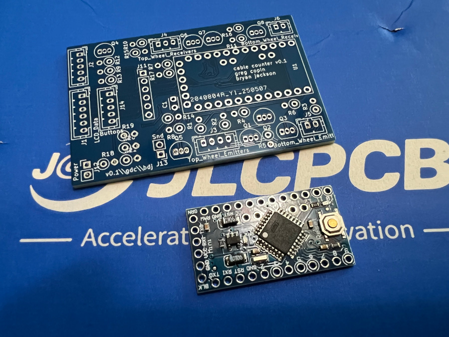
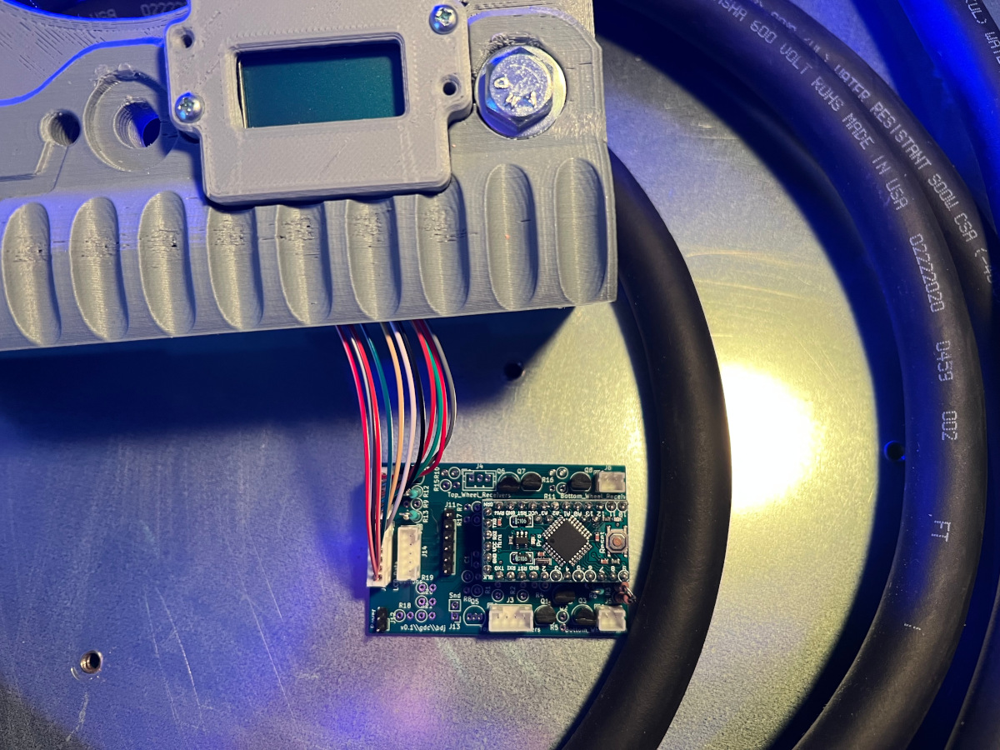
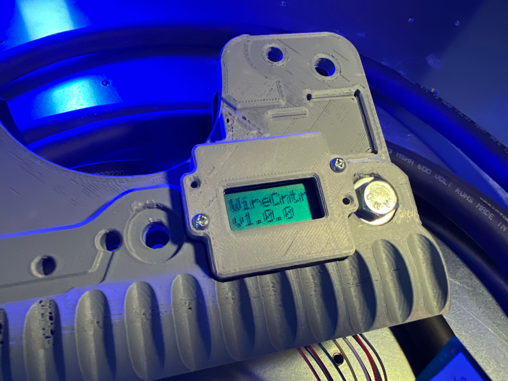
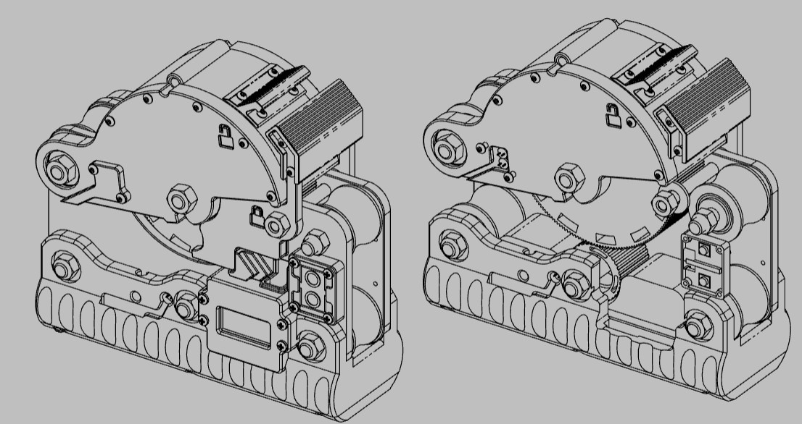

# Cable Counter - An Electronic Handheld Cable Measuring Device.

## Overview:

The project was initiated by a friend and co-worker (Bryan) to build an electronic cable length measuring device. The current method of measuring cable involves running a tape measure along the length of the cable as it is pulled off the roll or laying it on the ground to be measured. The proposed solution is to provide a handheld device that the cable can be pulled through, measuring and showing the current length of the cable. Additionally providing a visual and audio alert when nearing and reaching a preset length.

Bryan headed up the mechanical CAD design while I worked on the circuit design and firmware.

The basic components for the project include 3 pair of IR emitter/transistor LEDs, 16x2 (8x2) Character LCD running of an Arduino Pro Mini. The firmware is written in C, compiled with avr-gcc and flashed with AVRDUDE on Linux.

## First working prototype - v0.0:

I started with 2 IR emitter/phototransistor pairs on just the upper wheel (measuring 1/4" increments). I found the resulting measurements of cable to fluctuate depending how the cable was flexed as it was pulled under the counter wheel.

Converting the lower wheel to be a counter wheel also (1/2" increments), then averaging the calculated distance from both of the counting wheels has so far been showing accurate cable length measurements.

## Usable device - v0.1 (WIP):

Using KiCAD I designed the schematic, layed out the PCB and sent the exported Gerber file off to JLCPCB.

So far I have the board partially populated with the LCD working.

Current mechanical design this far:

